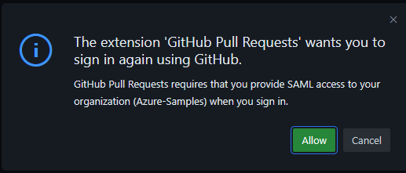
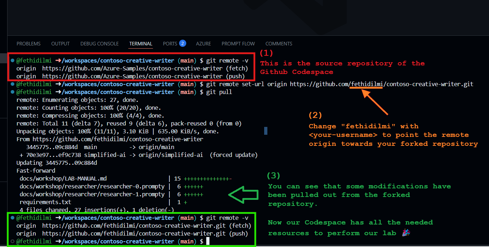
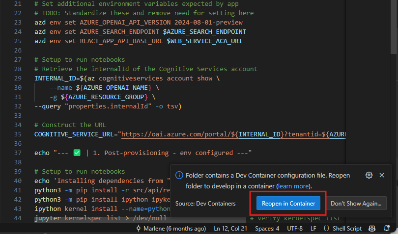

# Build a multi-tasking assistant with Azure OpenAI

## Introduction

Welcome to this hands-on lab where you are going to play with Azure and create your own multi-task assistant. Please read **carefully** any line of this lab as it will guide you to success.

## Pre-requisites

To be able to do the lab content you will also need:

- Basic understanding of Azure resources.
- A [Github](https://www.github.com) account.
- Basic understanding of Python or a similar language.

## Azure account requirements

<div class="important" data-title="Important">

> In order to deploy and run this example, you'll need to have all the following requirements. If you don't have them, see with your coach if he can provide them.<br>
> * **Azure account**. If you're new to Azure, [get an Azure account for free](https://azure.microsoft.com/free/cognitive-search/) and you'll get some free Azure credits to get started. See [guide to deploying with the free trial](docs/deploy_lowcost.md).
    - Make sure you have an **Owner** role to create and manage the labs' resources and deploy the infrastructure as code.
    - Make sure your Azure Subscription is not restricted through Azure Policies.
    - To be able to create play the CI/CD lab, you need to be able to create Entra ID application registrations.
> * **Azure subscription with access enabled for the Azure OpenAI Service**. If your access request to Azure OpenAI Service doesn't match the [acceptance criteria](https://learn.microsoft.com/legal/cognitive-services/openai/limited-access?context=%2Fazure%2Fcognitive-services%2Fopenai%2Fcontext%2Fcontext), you can use [OpenAI public API](https://platform.openai.com/docs/api-reference/introduction) instead.
    - Ability to deploy `gpt-4o` and `gpt-4o-mini`.
    - We recommend using `eastus2`, as this region has access to all models and services required.
> * **Azure subscription with access enabled for [Grounding with Bing Search API](https://blogs.bing.com/search/January-2025/Introducing-Grounding-with-Bing-Search-in-Azure-AI-Agent-Service)**
    - Some Azure subscriptions with Free Credit (like Visual Studio Subscriptions) are not eligible for Grounding with Bing Search API.
    - If you are using such subscription, ask your coach to provide you with a BING SEARCH API key, and follow their instructions to set it up.
> * **Azure subscription with access enabled for [Azure AI Search](https://azure.microsoft.com/en-gb/products/ai-services/ai-search)**

</div>

## Security

> When implementing this template please specify whether the template uses Managed Identity or Key Vault.
> <br><br>This template has either [Managed Identity](https://learn.microsoft.com/entra/identity/managed-identities-azure-resources/overview) or Key Vault built in to eliminate the need for developers to manage these credentials. Applications can use managed identities to obtain Microsoft Entra tokens without having to manage any credentials. 
> <br><br>Additionally, we have added a [GitHub Action tool](https://github.com/microsoft/security-devops-action) that scans the infrastructure-as-code files and generates a report containing any detected issues. To ensure best practices in your repo we recommend anyone creating solutions based on our templates ensure that the [Github secret scanning](https://docs.github.com/code-security/secret-scanning/about-secret-scanning) setting is enabled in your repos.

## Code of Conduct

This project has adopted the [Microsoft Open Source Code of Conduct](https://opensource.microsoft.com/codeofconduct/).

Resources:

- [Microsoft Open Source Code of Conduct](https://opensource.microsoft.com/codeofconduct/)
- [Microsoft Code of Conduct FAQ](https://opensource.microsoft.com/codeofconduct/faq/)
- Contact [opencode@microsoft.com](mailto:opencode@microsoft.com) with questions or concerns

For more information see the [Code of Conduct FAQ](https://opensource.microsoft.com/codeofconduct/faq/) or
contact [opencode@microsoft.com](mailto:opencode@microsoft.com) with any additional questions or comments.

## Responsible AI Guidelines

This project follows below responsible AI guidelines and best practices, please review them before using this project:

- [Microsoft Responsible AI Guidelines](https://www.microsoft.com/en-us/ai/responsible-ai)
- [Responsible AI practices for Azure OpenAI models](https://learn.microsoft.com/en-us/legal/cognitive-services/openai/overview)
- [Safety evaluations transparency notes](https://learn.microsoft.com/en-us/azure/ai-studio/concepts/safety-evaluations-transparency-note)

## Other Resources

* [Prompty Documentation](https://prompty.ai/)
* [Quickstart: Multi-agent applications using Azure OpenAI article](https://learn.microsoft.com/en-us/azure/developer/ai/get-started-multi-agents?tabs=github-codespaces): The Microsoft Learn Quickstart article for this sample, walks through both deployment and the relevant code for orchestrating multi-agents in chat.
* [Develop Python apps that use Azure AI services](https://learn.microsoft.com/azure/developer/python/azure-ai-for-python-developers)

---

# Lab 1 - Deploy a Creative Writing Assistant

## Step 1: Overview

Contoso Creative Writer is an app that will help you write well researched, product specific articles. Once launched, enter the required information and then click "Start Work". To watch the steps in the agent workflow select the debug button in the bottom right corner of the screen. The result will begin writing once the agents complete the tasks to write the article.

This application demonstrates how to create and work with AI agents driven by [Azure OpenAI](https://learn.microsoft.com/en-us/azure/ai-services/openai/). It includes a FastAPI app that takes a topic and instruction from a user and then calls a research agent that uses the [Grounding with Bing Search API](https://learn.microsoft.com/en-us/azure/ai-services/agents/how-to/tools/bing-grounding?view=azure-python-preview&tabs=python&pivots=code-example) to research the topic, a product agent that uses [Azure AI Search](https://azure.microsoft.com/en-gb/products/ai-services/ai-search) to do a semantic similarity search for related products from a vector store, a writer agent to combine the research and product information into a helpful article, and an editor agent to refine the article that's finally presented to the user. You are going to build and run this application.


This project template provides the following features:

* [Azure OpenAI](https://learn.microsoft.com/en-us/azure/ai-services/openai/) to drive the various agents
* [Prompty](https://prompty.ai/) to create, manage and evaluate the prompt into our code.
* [Grounding with Bing Search API](https://blogs.bing.com/search/January-2025/Introducing-Grounding-with-Bing-Search-in-Azure-AI-Agent-Service) to research the topic provided
* [Azure AI Search](https://azure.microsoft.com/en-gb/products/ai-services/ai-search) for performing semantic similarity search
  


## Step 2: Setup your environment

You have a few options for setting up this project.

- 🥇 **Preferred method** : Pre-configured GitHub Codespace
- 🥈 Local Devcontainer
- 🥉 Local Dev Environment with all the prerequisites detailed below

<div class="tip" data-title="Tips">

> To focus on the main purpose of the lab, we encourage the usage of devcontainers/codespace as they abstract the dev environment configuration, and avoid potential local dependencies conflict.
> You could decide to run everything without relying on a devcontainer. To do so, make sure you install all the prerequisites detailed below in the chapter "local development".

</div>

### Option 1: GitHub Codespaces (preferred option)

1. Connect with your Github account.

    <div class="warning" data-title="Warning">

    > - Make sure you connect to Github with your personal account and not with an Enteprise-Managed User (through an identity provider).
    > - If you want to use your **enterprise** account, make sure your organization allows forks and has enabled the use Github Codespaces.

    </div>

2. Fork the this [repository](https://github.com/fethidilmi/contoso-creative-writer/fork).

3. Open GitHub Codespaces on the official repository ```Azure-Samples/contoso-creative-writer```:

   [ ](https://codespaces.new/Azure-Samples/contoso-creative-writer)

    <div class="warning" data-title="Warning">

    > If you are using a Github Enterprise Managed User, you might be prompted to login to your Github account against the ```Azure-Samples``` organisation (which is the upstream of your forked repo). If so, follow the instructions to do so.
    
    </div>

4. Once inside the Codespace, change the remote origin to your forked repo. 
    ```console
    git remote set-url origin https://github.com/<your-github-username>/contoso-creative-writer.git
    git pull
    ```
    
    This should see and output like this:

    

    <div class="tip">

    > **Congratulations 🎉**<br><br>
    > You've succesfully connected to the lab's repository through GitHub Codespace🎉.<br>
    > You can now move on the [Deployment](step=1#deployment) part.

    </div>

### Option 2: VS Code Dev Containers

A related option is VS Code Dev Containers, which will open the project in your local VS Code using the [Dev Containers extension](https://marketplace.visualstudio.com/items?itemName=ms-vscode-remote.remote-containers):

1. Start Docker Desktop (install it if not already installed)

2. Open the project:
   
    [](https://vscode.dev/redirect?url=vscode://ms-vscode-remote.remote-containers/cloneInVolume?url=https://github.com/fethidilmi/contoso-creative-writer.git)

    <div class="warning" data-title="Warning">
    
    > - If you do not have Docker Desktop installed/working, you can use [Windows Subsystem for Linux (WSL)](https://learn.microsoft.com/en-us/windows/wsl/install) as an alternative.
    > - Once installed, clone the forked github repository and run the following:
    >```console
    >git clone https://github.com/yourusername/contoso-creative-writer.git
    >cd contoso-creative-writer
    >code . &
    >```
    > - VS Code will will detect the Dev Container and prompts you to Reload the repository inside of it. Accept it:
    > 
    </div>

3. In the VS Code window that opens, once the project files show up (this may take several minutes), open a terminal window.

4. Install required packages:

    ```shell
    cd src/api
    pip install -r requirements.txt
    ```

    <div class="tip">

    > **Congratulations 🎉**<br><br>
    > You've succesfully connected to the lab's repository through **VS Code Dev Containers**🎉.<br>
    > You can now move on the [Deployment](step=1#deployment) part.

    </div>

### Option 3: Local environment

1. Setup local pre-requisites

    * [Azure Developer CLI (azd)](https://aka.ms/install-azd)
    * [Python 3.10+](https://www.python.org/downloads/)
    * [Docker Desktop](https://www.docker.com/products/docker-desktop/)
    * [Git](https://git-scm.com/downloads)

    > **Note for Windows users:**
    > - If you are not using a container to run this sample, we recommend using the hooks that run shell scripts, and for that you would need a Linux container. To provision this sample correctly while we work on updates we recommend using [git bash](https://gitforwindows.org/).<br>
    > - Another option **(which we recommend)**, is to use [Azure Cloud Shell](https://learn.microsoft.com/en-us/azure/cloud-shell/new-ui-shell-window) with Bash for all these operations.

2. Clone your forked repository:

    ```shell
    git clone https://github.com/yourusername/contoso-creative-writer.git
    cd contoso-creative-writer/
    ```

3. Install required packages:

    ```shell
    cd src/api
    pip install -r requirements.txt
    ```

## Step 3: Deployment

Once you've opened the project in **Codespaces**, **Dev Containers**, or **locally**, you can deploy it to Azure.

<div class="important" data-title="Important">

> - Deployment might fail for different reasons, so we invite you to check the **Guidance** section below for special instructions for certain cases.
> - We can categorize the different deployment failure as follows:
>   - Grounding with Bing Search ineligibility
>   - Insufficient Azure permissions
>   - Code requirerments incorrect

</div>

1. Sign in to your Azure account. You'll need to login to both the Azure Developer CLI and Azure CLI:

    i. First with Azure Developer CLI

    ```shell
    azd auth login
    ```

    > This will create a folder under `.azure/` in your project to store the configuration for this deployment. You may have multiple azd environments if desired.

    ii. Then sign in with Azure CLI
    
    ```shell
    az login --use-device-code
    ```

    <div class="tip" data-title="Tips">

    > - If the desired subscription is not displayed, use your keyboard's arrow to scroll through the list of subscriptions until you find it. 
    > - If the desired subscription is still not displayed, you may have to specify the tenant for both commands. `azd auth login --tenant-id XXX  --use-device-code` and `az login --tenant XXXX  --use-device-code`

    </div>

2. Provision the resources and deploy the code

    ```shell
    azd up
    ```

    > - You will be prompted to select some details about your deployed resources, including location. As a reminder we recommend ```East US 2``` as the region for this project but you can try with another one if you want.
    > - This project uses `gpt-4o` and ```gpt-4o-mini``` which may not be available in all Azure regions. Check for [up-to-date region availability](https://learn.microsoft.com/azure/ai-services/openai/concepts/models#standard-deployment-model-availability) and select a region during deployment accordingly.

    After running azd up, you may be asked the following question during `Github Setup`:

    ```shell
    Do you want to configure a GitHub action to automatically deploy this repo to Azure when you push code changes?
    (Y/n) Y
    ```

    You should respond with `N`, as this is not a necessary step, and takes some time to set up.

    > Once the deployment is complete, you should be able to scroll up in your terminal and see the url that the app has been deployed to. It should look similar to this:
    ```Ingress Updated. Access your app at https://env-name.codespacesname.eastus2.azurecontainerapps.io/```<br><br>
    > **Navigate to the link to try out the app straight away! 🎉**

## Step 4: Deal with Common Deployment Issues

When running the ```azd up``` command, you may face some issues. Below are some common issues and their solutions.

### Issue 1: Grounding with Bing Search ineligibility

<div class="important" data-title="Error Message">

>```json
>{
>  "code": "SkuNotEligible",
>  "message": "The subscription is not eligible for the selected SKU G1"
>}
>```

</div>

<div class="info" data-title="Explanation">

> This means that your Azure subscription is not eligible for Grounding with Bing Search API. You need to ask your coach to provide you with a ```BING_SEARCH_API_KEY``` and follow the recommended solution below.

</div>

<details>

<summary> Toggle Solution ✅</summary>

1. Go to the `infra/core/bing/bing-search.bicep` file and comment out the `bing` resource.
2. Add the ```BING_SEARCH_API_KEY``` in the corresponding output.

```bicep
metadata description = 'Creates a Bing Search Grounding instance.'
param name string
param location string = 'global'
param sku string = 'G1'
param tags object = {}

// Comment this resource
// resource bing 'Microsoft.Bing/accounts@2020-06-10' = {
//   name: name
//   location: location
//   kind: 'Bing.Grounding'
//   tags: (contains(tags, 'Microsoft.Bing/accounts') ? tags['Microsoft.Bing/accounts'] : json('{}'))
//   sku: {
//     name: sku
//   }
// }

#disable-next-line outputs-should-not-contain-secrets
output bingApiKey string = '<bing-search-api-key-given-by-your-coach>' //instead of bing.listKeys().key1
output endpoint string = 'https://api.bing.microsoft.com/'
output bingName string = name //instead of "bing.name"
```

3. In the ```infra/ai/hub.bicep```, locate the bingConnection resource and add the ```BING_SEARCH_API_KEY``` while commenting out the ```bing``` resource:
```bicep
  ...
  ...
  //Locate the bingConnection resource and add the bing-search-api-key
  resource bingConnection 'connections' = {
    name: bingConnectionName
    properties: {
      category: 'ApiKey'
      authType: 'ApiKey'
      isSharedToAll: true
      target: 'https://api.bing.microsoft.com/'
      credentials: {
        key: '<bing-search-api-key-given-by-your-coach>' //instead of bing.listKeys().key1
      }
      metadata: {
        location: 'global'
      }
    }
  }
}

...

//resource bing 'Microsoft.Bing/accounts@2020-06-10' existing = {
//  name: bingName
//}

output name string = hub.name
output id string = hub.id
output principalId string = hub.identity.principalId
```
4. You can re-run ```azd up``` command to deploy the application again.

</details>

### Issue 2: Insufficient Quotas

<div class="important" data-title="Error Message">

>```shell
>ERROR: error executing step command 'provision': deployment failed: error deploying infrastructure: deploying to subscription:
>
>Deployment Error Details:
>InvalidTemplateDeployment: The template deployment 'cognitiveServices' is not valid according to the validation procedure. The tracking id is '8dcef7cc-920e-4f5e-ac52-2b60dedeab9a'. See inner errors for details.
>InsufficientQuota: This operation require 80 new capacity in quota Tokens Per Minute (thousands) - gpt-4o - GlobalStandard, which is bigger than the current available capacity 8. The current quota usage is 0 and the quota limit is 8 for quota Tokens Per Minute (thousands) - gpt-4o - GlobalStandard.
>```
</div>

<div class="info" data-title="Explanation">

> - This error is due to insufficient quota for the Azure AI Service.
> - We can see that we are request ```80,000``` Tokens Per Minute capacity, while we have a maximum capacity of ```8,000``` Tokens Per Minute (and ```8000``` left).

</div>

<details>

<summary> Toggle Solution ✅</summary>

1. Go to ```infra/ai.yaml``` and split your available capacity between the different models.
2. Try to allocate the highest share of available capacity to gpt-4 model, because it's the most called model in this lab.

```yaml
# yaml-language-server: $schema=ai.yaml.json

deployments:
  - name: text-embedding-ada-002
    model:
      format: OpenAI
      name: text-embedding-ada-002
      version: "2"
    sku:
      name: "Standard"
      capacity: 2  # default template value: 20
  - name: gpt-4
    model:
      format: OpenAI
      name: gpt-4o
      version: "2024-05-13"
    sku:
      name: "GlobalStandard"
      capacity: 4 # default template value: 80
  - name: gpt-4-evals
    model:
      format: OpenAI
      name: gpt-4o-mini
      version: "2024-07-18"
    sku:
      name: "GlobalStandard"
      capacity: 2 # default template value: 80
```
</details>

<div class="warning" data-title="Warning">

> - You may encounter issues in the postprovisioning step in relation with these quota adjustments. If so, you may want to adjust the capacity such that ```text-emdedding-ada-002``` has a higher capacity than ```gpt-4-evals```
> - Keep in mind that you can manually set the from Azure AI Foundry portal the quotas without needing to redeploy the application every time.

</div>

### Issue 3: Code requirements incorrect

If you are not in Codespace or Devcontainer, you may face some issues with the code requirements. Below are some common ways to solve them:
- ```pip install --upgrade "<your-package>"``` to upgrade a stale version of a package.
- Look at ```.devcontainer/Dockerfile``` to see if you are lacking some system-level packages

---

# Lab 2 - Building and running Contoso Creative Writer

We will now build and run Contoso Creativer Writer a multi-agent application!

All the commands in this notebook will need to be run from the terminal!

## [Step 1: Start the FastAPI server](#step-1-start-the-fastapi-server)

Complete the following tasks...

**Tasks for you to do:**

<br>

1. We'll start by navigating to the correct folder. 

**Run the below cell and copy and paste the output to the terminal**

```console
cd ./src/api
```

2. Next we'll run the FastAPI webserver with the following command (again copy and paste the output in the terminal):

```console
fastapi dev main.py
```

3. Next you'll need to change the visibility of the **8000** and **5173** ports to public in the **PORTS** tab.

    You can do this by right clicking on the visibility section of the port, selecting port visibility and setting it to public.
    <br>The ports tab should look like this:

    

To complete this step once the ports are public navigate back to the terminal tab and confirm that you can see *Application startup complete*.

## **Step 2: Start the web server**

Complete the following tasks...

**Tasks for you to do:**

1. Open a **new terminal** and navigate to the web folder

    Once you've completed the above steps. You'll need to:
    - Open a **new terminal**
    - **Navigate to the web folder** by running the below command and copying and pasting the output to the terminal.

```console
cd ./src/web
```

2. Next we will install the node packages (copy and paste output to the terminal):

```console
npm install
```

3. We can then run the web app with a local dev web server with this command (run the output in the terminal here too):

```console
npm run dev
```

4. Navigate to the Application:
    - Once you've run the above command you should see an `http://localhost:5173/` link in the terminal.
    - Right click the link or click the **open on browser** button that comes up as a Gitub notification in the bottom right corner of the screen.
    - If you see a page from Github select the **continue** button. If not skip you should already see your app.
    - You should now see the app appear on your screen!

To complete this step confirm that you can see the Constoso Creative Writer application.

## **Step 3: Test the app**

Complete the following tasks...

**Tasks for you to do:**

1. Click the **Example** button to fill out the example information. Read the example instructions.

2. **Start Work** button to get Contoso Creative Writer to generate an article.

3. Click on the small **Debug** button at the bottom right of the Application to see which agent steps are carried out.

To complete this step confirm that an article was generated that includes citation links and the products requested.

> **⭐BONUS:⭐** You can generate the article in a language of your choice. 
><br> In the Assignment section add an instruction to create the article in your language and run the app again!

**Congratulations you've succesfully built and ran Contoso Creative Writer🎉**
- [✅] Step 1: Start the FastAPI server 
- [✅] Step 2: Start the Web Server
- [✅] Step 3: Test the app

> ⏰**Note:**
> - Remember this lab is self paced so you can always complete it on your own, even after the session. 
> - Do not worry if you are not able to finish everything during the workshop

---

# Lab 3 - Setting up automated evaluations and deployment with Github Actions

Contoso Creative Writer is set up to run a CI/CD pipeline, which stands for Continuous Integration and Continuous Deployment.

In this sample code the CI/CD pipeline includes the following: 
1. **Build and Deploy:** Automatically building and deploying the latest version of the code in production (This helps us confirm things are working as expected.)
2. **Evaulations:** Automatically running evaulations on a test article to see how fluent, grounded, relevant and coherent the final response was.

<br>

## **Step 1: Set up the azd pipeline configuration**

We will set up the CI/CD pipeline with azd and GitHub actions.

#### Task 1: Initialize git Setup

1. To do this **open a new terminal**.

2. You then need to **add github CLI as an authentication helper so you have the correct permissions by running the following commands:

```console
gh auth setup-git
```

#### Task 2: Configure the CI/CD pipeline

We can the use azd to **configure the CI/CD pipeline**:

```console
azd pipeline config
```

1. You will be asked if you want to commit and push your local changes. Choose `Y`
    - You may be asked 'What would you like to do now?' Press enter to select `I have manually enabled GitHub Actions. Continue with pushing my changes.`
    - You should see two links in your terminal. **Select the second link** to view your pipeline status. Where you will then see a green button.

2.  Click the green button that says **understand my workflows go ahead and enable them.** and return to the terminal after clicking the button.

3. **Rerun** the **azd pipeline config** command.
    - Select the second link again.
    - If you do not see anything on the screen wait for 10 seconds and then **reload the page.**

4. You should now see the two Github action workflows running on the screen, similar to what you see in the below image.


- Look at the subheading of the actions and wait till the **Evaluate** one turns green.
- It will likely take a few minutes to complete but once complete click the Evaluate action.
- The **DEPLOY** action will likely fail as we have not had the time to run azd up in this workshop.

## **Step 2: Examine evaluations**
You now should see a table with some scores for **relevance, fluencey, coherence and groundedness** that looks like the image below:


<br>

The scores are from 1-5, with 5 being the highest mark. These are used to help us know how well the model is performing.

1. Examine the evaluations and think of some ways you might be able to improve a score in the future.

Congratulations you've succesfully automated evaluations and deployment🎉

- [✅] Step 1: Set up the azd pipeline configuration
- [✅] Step 2: Examine evaluations

---

# Lab 4 - Understanding agents and prompt engineering with Prompty

## Overview
Building Large Language Model (LLM) applications​ is hard! Companies want to build AI solutions, but how can they do this in a reliable, reproducible and observable way?​

- Getting LLM apps to work with various real world inputs ​
- Debugging (local and production)​ to understand failures
- Setting up and managing production infrastructure automation

This workshop will introduce new tooling that provides practical solutions to these problems. 

## Setting Up Environment

In this section we will focus on four key outcomes, each split into their own notebook:

1. Understanding agents and prompt engineering with Prompty.
2. Utilizing Prompty tracing for debugging and observability.
3. Building and running Contoso Creative Writer.
4. Setting up automated evaluations with GitHub Actions.

```bash
pip install -r requirements.txt
pip install marshmallow==3.22.0 # if not present in requirements.txt

azd env get-values > .env
sed 's/^/export /' .env >> ~/.bashrc
source ~/.bashrc
```

After completing the setup stage, you can get started with the rest of the workshop. 

## 1.1. What are AI agents?

Contoso Creative Writer is an Agentic Application.

**In artificial intelligence an agent is a program designed to:**

-   Perceive its environment
-   Make decisions
-   Take actions to achieve specific goals

For Contoso Creative Writer, the goal is to help the marketing team at
Contoso Outdoors write well-researched, product-specific articles.

Contoso Creative Writer is made up of 4 agents that help achieve this
goal.


## 1.2. How is an AI agent built?

Each agent in Contoso Creative Writer is built with
[Prompty](https://prompty.ai/)!

Prompty is a new asset class and file format for LLM prompts that aims
to provide observability, understandability, and portability for
developers.

**The Prompty file:**

-   A Prompty file is not tied to any language as it uses the markdown
    format with YAML

-   The file contains two main parts:

    -   **Front Mattter:**
        -   This is the first part of the prompty file

        -   It is written in YAML and is contained inside two `---`
            seperators.

        -   It includes basic details about the prompt, the model
            configuration and prompty inputs.

            ```yaml
            ---
            name: My Prompty File 
            description: >-
            This is a prompt about Prompty
            authors:
            - Seth Juarez
            model:
            api: chat
            configuration: 
                type: azure_openai
                azure_deployment: gpt-35-turbo
                api_version: 2024-05-13
            sample:
            instructions: Can you tell me more about Prompty?  
            ---
            ```

    -   **Prompt Template:**
        -   This is the base prompt that is sent to the LLM once the
            prompty is executed.

        -   It uses Jinja format to pass values either specified in the
            front matter or from the application to the LLM.

        -   Given *\'name\': Marlene*, the variable *{{name}}* will be
            replaced by *Marlene* at runtime.

            ```yaml

            system:
            You are a helfpul assistant that uses gpt-35-turbo to answer questions about Prompty. 
            You provide helpful information and reply in a friendly tone

            user:
            {{instructions}}
            ```

**The VS Code extension tool:**

-   The Prompty extension allows you to run Prompty files directly in VS
    Code.
-   It has been pre-installed for this workshop, but you can also find
    it in the Visual Studio Code Marketplace.

We\'ll look at how to use both of these to build and run an AI Agent
next.

## 1.3. Building an AI Agent

To help us understand practically how we build an AI agent, we will
build the **Researcher Agent** step by step.

In order to build the Researcher agent you will complete the following 3 steps:</p>
> -   **Step 1:** Build a multi-lingual query generator
> -   **Step 2:** Understanding LLM function calling with Prompty
> -   **Step 3:** Build the tools and execute the research

Let\'s start with step 1.

### **Step 1: Build a multi-lingual query generator**

The researcher agent generates queries that can be used to look for
information online. It also allows us to find search
results in multiple languages.

#### Task 1

<div class="task" data-title="Instructions">

> - Open the `docs/workshop/researcher/researcher-0.prompty` file, read the prompt and **click the play button** on the top right of the file.
> - If you are inside Github Codespaces, and you have run the setup instructions earlier, you should see the results in the terminal.
> - If you are your own environment, you may need to restart vscode to refresh the environment variables.

</div>

<div class="info" data-title="Observations 👀:">

> -   Observe the output in the terminal.
> -   Look in the Prompty file, notice the following instructions in the **sample section**: <br> `instructions: Can you
>     generate queries to find the latest camping trends and what folks
>     are doing in the winter? Use \'en-US\' as the market code.`
> -   Since you haven't replace `{{instructions}}` with your own instruction, the LLM used the sample instructions to generate the response.

</div>

#### Task 2

<div class="task" data-title="Instructions">

> - Edit the instructions to use a new language. (For example
> use `es-ES` instead of `en-US`, to get the results back in Spanish)

</div>

#### Task 3

<div class="task" data-title="Instructions">

> - Explore the `docs/workshop/instructions.json` file.
> - Run the `docs/workshop/researcher/researcher-1.prompty` in VS Code and explore the results.

</div>

<div class="info" data-title="Observations 👀:">

> -   Observe the output in the terminal.
> -   You should see that the LLM has generated a response related to the weather in the United States today.

</div>

### **Step 2: Understanding LLM function calling with Prompty**

In order for the researcher to generate even better queries it needs to
know which search functions are avaialble to it.

- Using the Prompty **tools** parameter an LLM can choose from
    functions described in a json file.
- We can add information about which functions (sometimes called
    tools), the LLM has access to in a **functions.json** file.
- Information from a json file is passed to prompty using the
    `functions.json` format.

#### Task 1

<div class="task" data-title="Instructions" >

> In the case of the researcher we have a **functions.json** file with
descriptions of 3 functions:
>-   find_information
>-   find_entities
>-   find_news
>
> Open `functions.json` and read the description of the **find_information** function.
>
> Its important to note that **Prompty files can also be executed using
Python code.** To see how Prompty works with tools we will
switch to using code instead of pressing play on the file.

<details>
<summary>📚 Run the code:</summary>

```python
import prompty
import prompty.azure
import os

instructions = "Can you find the best educational material for learning Python programming?"
prompty.execute(os.getcwd() + "/researcher/researcher-2.prompty", inputs={"instructions": instructions})
```

</details>

</div>

<div class="info" data-title="Observations 👀">

> - Observe the results. What do you see is different from the previous output?
> - Navigate to `docs/workshop/researcher/researcher-2.prompty` and notice that `functions.json` has been added to **tools** under the *parameters* section in the file.
> - What is the name of the tool called?
> - In the result from running the Prompty file we saw that the **find_information** function was selected.
>   - From its description in the `./docs/workshop/researcher/functions.json` file can you understand why it was chosen?
>   - Observe that it finds general information on the web.
>   - The LLM used the **instruction** we gave it and the **descriptions** it saw in *functions.json* to pick which function to call.
>   - It also figured out which parameter values should be passed to the function.

</div>

<div class="tip" data-title="Take away">

> - You should be getting a result like this: <br> ```[ToolCall(id='call_TgypFxasFvpYsBRin0yW9j0l', name='find_information', arguments='{"query":"best educational material for learning Python programming","market":"en-US"}')]```
> - This means that Prompty is calling the **find_information** function to retrieve relevant input related to the users query.

</div>

#### Task 2

We can influence which function is called by being more specific about the instructions we give the LLM. This is a form of **Prompt Engineering**.

<div class="task" data-title="Instructions">

> Get the LLM to use the **find_entities** function to help us find people, places or things by running the cell below:
>
> ``` python
instructions = "Who is the person who invented the Python programming language?"
prompty.execute(os.getcwd() + "/researcher/researcher-2.prompty", inputs={"instructions": instructions})
> ```

</div>

<div class="info" data-title="Observations 👀">

> Note that the **find_entities** function was selected by the LLM based on:
> 1.  **The description of the function** in `./docs/workspace/researcher/functions.json`
> 2.  The **instructions** we passed to it.

</div>

#### Task 3

> **TODO 3:** Let\'s try to get the LLM to call the **find_news**
> function by running the cell below:
> ``` python
instructions = "Find the latest news about Microsoft?"
prompty.execute(os.getcwd() + "/researcher/researcher-2.prompty", inputs={"instructions": instructions})
>```
>
> **🐞BUG ALERT:** A bug has purposefully been left in the functions.json file.
>
> Observations 👀:
>
> -   Which function call has been selected, if any?
> -   Is this the function we want?
> -   The find_news function has not been selected by the LLM.
> -   Look in the functions.json file and see what\'s wrong.

> **TODO 4:** Add the function description for find_news to the
> functions.json file. (💡Click the play icon for the details.) Once
> added rerun the cell above!
> **find_news function description:** 
> ``` json
{
    "type": "function",
    "function": {
      "name": "find_news",
      "description": "Finds news on the web given a query. This function uses the Bing Search API to find news on the web given a query. The response includes the most relevant news articles from the web and should be used if you're looking for news.",
      "parameters": {
        "type": "object",
        "properties": {
          "query": {
            "type": "string",
            "description": "An optimal search query to find news on the web using the Bing Search API"
          },
          "market": {
            "type": "string",
            "description": "The market to search in, e.g. en-US - it should match the language of the query"
          }
        },
        "required": [
          "query"
        ]
      }
    }
  }
> ```

### **Step 3: Build the functions and execute the research**

We saw that the researcher:

-   Selects which function to call
-   Generates a query to pass to the function
-   Selects a market code to pass to the function.

When we execute a Prompty file that has a **functions.json** file added
to the **tools** parameter, the LLM returns a **list of Tool Calls**
(also known as function calls) that look like this:

``` python
[ToolCall(id='call_JtomZ3gCGHEa5MBxy6M3vypv', name='find_entities', arguments='{"query":"inventor of Python programming language","market":"en-US"}')]
```

But where are the functions it should be calling?

-   The Python code for the functions described in *functions.json* can be found in the [researcher3.py](researcher/researcher3.py) file.
-   These functions will pass the query and market code to the Bing Search API.
-   Open the [researcher3.py](researcher/researcher3.py) file and try
    and find the **find_information, find_news, find_entities**
    functions.

To put everything together the **research** function in
[researcher3.py](researcher/researcher3.py) calls:

-   an **execute_researcher_prompty** function that has the code we saw
    earlier to execute the prompty file
-   an **execute_function_calls** function that runs code to execute all
    the functions calls

Complete the final task\...

**Run the code:**

> **TODO:** Run the cell below to run the full researcher agent!
>
> -   Try different instructions and see which results you get and which
>     function is called.
> ```python
import sys
import os
from pprint import pprint
>
> # Add the path to sys.path
sys.path.append(os.path.abspath('../../src/api/agents/researcher'))
>
> from researcher import execute_research
>
> instructions = "Can you find the best educational material for learning Python programming"
>
> # Execute the function calls
result = execute_research(instructions)
pprint(result)
>```

**Step 3 Complete ✅**

**Congratulations you\'ve succesfully built your first AI Agent with Prompty🎉**

-   \[✅\] Step 1: Build a multi-lingual query generator
-   \[✅\] Step 2: Understanding LLM function calling with Prompty
-   \[✅\] Step 3: Build the tools and execute the research

We can now succesfully move on to learning outcome 2

---

# Lab 5 - Utilizing Prompty tracing for debugging and observability

When running Applications driven by LLMs, sometimes things don't go as expected! 
<br>It's important to have a way to debug your LLM workflow so you can see where things are working. 
<br>Tracing helps you visualize the execution of your prompts and clearly see what inputs are being passed to the LLM. 

To illustrate how to use local tracing in prompty let's build and debug a custom agent!


## What is the social media agent? 

Today marketing departments not only need to write catchy blogs but they should also be able to promote the blogs and grow an audience on social media! 
<br> We will be building a social media agent that can help us generate twitter threads! 

You should see a `./socialmedia/social.prompty` folder in the workshop folder. This folder contains:

- a **social.py file:** Uses the **execute_social_media_writer_prompty** and **run_social_media_agent** functions to send the inputs and prompts to the LLM. <br>It also imports the research function from the researcher agent to let it access information from online.  
- a **social.prompty file:** This contains the base prompt for the social media agent. 
<br>It has been instructed to generate a thread of **4 tweets**.

> Steps to build and debug the social media agent:
>
> **Step 1:** Run the code for social media agent<br>
> **Step 2:** Use Prompty tracing to identify and fix the bug

Let's get started by testing out the agent!

## **Step 1: Run the code for social media agent**
The social media agent is a great way to generate twitter threads that are **4 tweets** long.  

Complete the following task.

---
**Tasks for you to do:**
> **TODO:** Run the following code into your jupyter notebook.
>```python
import sys
import os
>
># Add the path to sys.path
sys.path.append(os.path.abspath('../../docs/workshop/socialmedia'))
>
>from social import run_social_media_agent
>
>research_instructions = "Find information about AI Agents"
social_media_instructions = "Write a fun and engaging twitter thread about AI Agents given the research."
>
>run_social_media_agent(instructions=research_instructions, social_media_instructions = social_media_instructions)
>```
>
> **🐞BUG ALERT:** A bug has been purposefully left in the prompty file. We will use tracing to quickly spot the bug and fix it!
>
> **Observations 👀:**
>   - What do you observe that is strange from the results?
>   - Remember you should see 4 tweets in a twitter thread. Is this what is being returned?
>   - Try to think what could be causing the bug? 

## **Step 2: Use Prompty tracing to identify and fix the bug**
We will use Prompty's built in tracing to identify the bug. 

Complete the following task... 

> **TODO 1:** To see the trace generated by Prompty open the **workshop** folder in the file explorer and look for a **.runs** folder in it. 
> Select this folder and click the **execute_social_media_writer_prompty.tracy** file at the top of the folder. 
> **Observations 👀:**
>   - This page shows you information that prompty has sent to or recieved from the LLM. 
>   - In this specific case look at the *Completion Tokens* amount. 
>   - This shows less than a 1000 tokens, which is not enough for us to generate a twitter thread. 

> **TODO 2:** To fix this bug go to the `socialmedia/social.prompty` file and edit the *max_tokens* amount to make it 1500. 
> Rerun the code in the cell above and confirm the full thread is generated!

Congratulations you've succesfully used Prompty tracing for debugging🎉
- [✅] Step 1: Run the code for social media agent
- [✅] Step 2: Use Prompty Tracing to identify and fix the bug

**⭐Bonus⭐:** If you have time at the end of the workshop come back and edit the social media agent prompt to generate content for another site like LinkedIn.

Now that we have a good understanding of how to build and debug agents with Prompty let's run Contoso Creative Writer, a multi-agent solution!

## Conclusion

You have now completed the workshop!